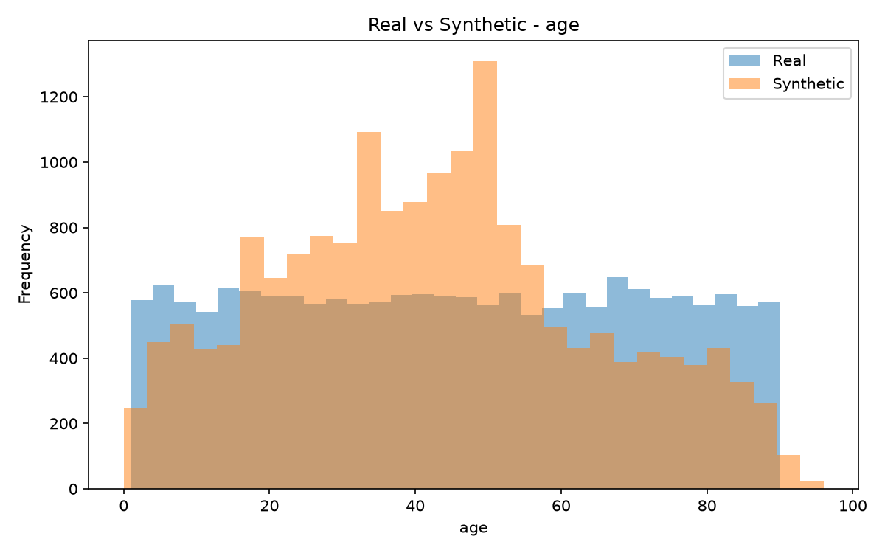
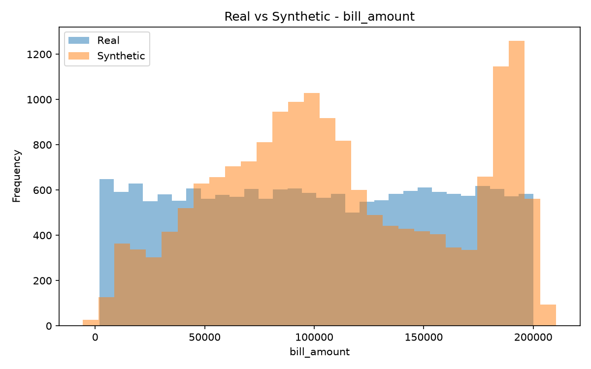
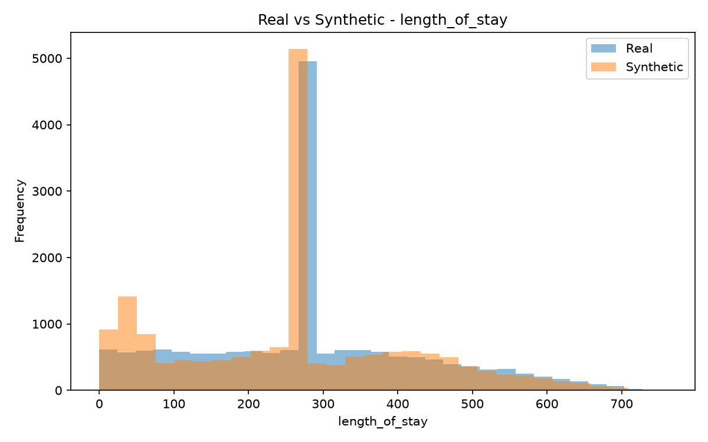
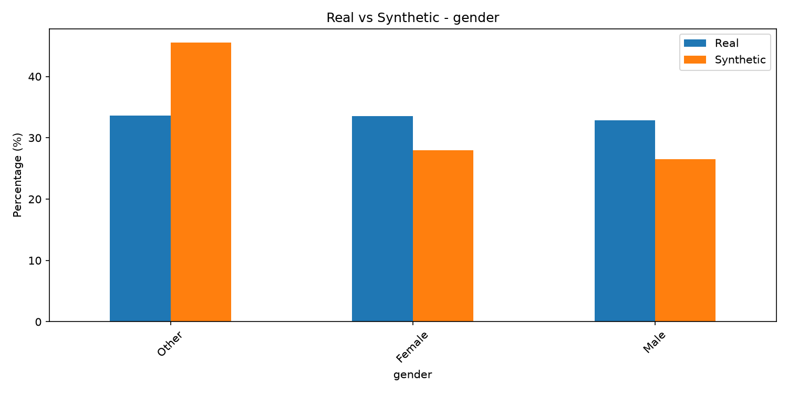
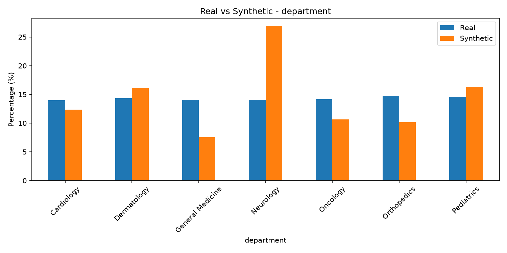
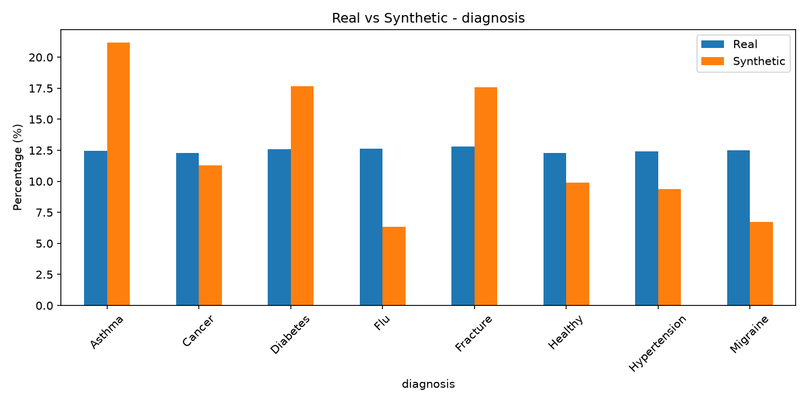
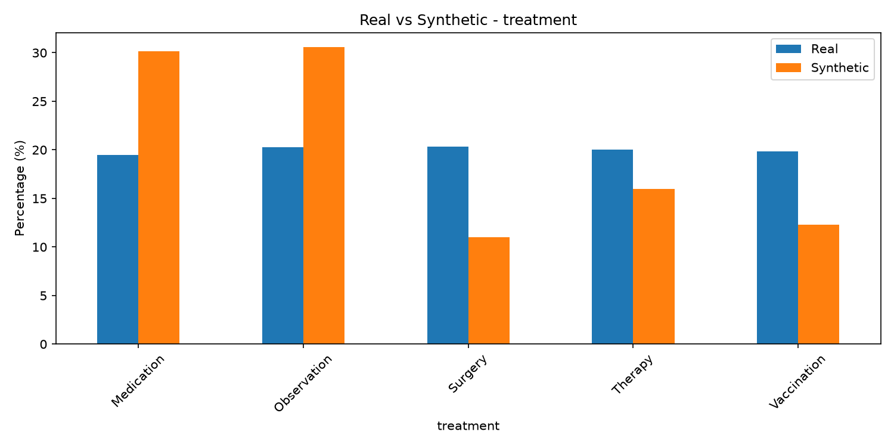
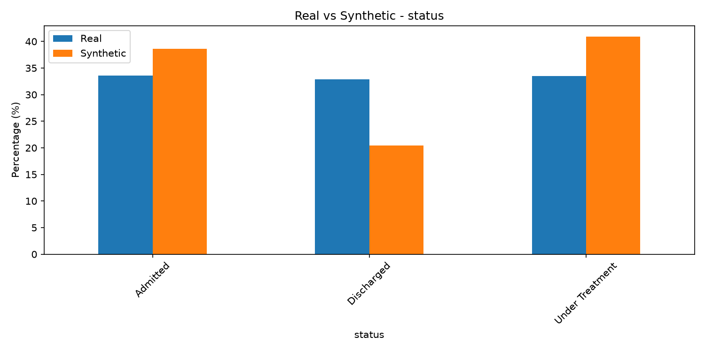

Synthetic Medical Records with CTGAN

An end-to-end Python pipeline that cleans a tabular medical dataset, trains a CTGAN (Conditional Tabular GAN) model, generates synthetic patient records, and measures how closely the synthetic data matches the original.

Note: This is a learning and portfolio project, not a production healthcare system. The synthetic data has not been tested for privacy or memorization. See Limitations.

Table of Contents
At a Glance
Pipeline
Dataset
Preprocessing
Model
Validation of Synthetic Data
Results
Project Structure
How to Run
Tech Stack
What I Learned
Limitations
Future Improvements
Author
At a Glance
Item	Value
Real records used	17,498
Synthetic records generated	17,498
Model	CTGAN, 300 epochs, batch size 500
Invalid records fixed in raw data	4,382 negative hospital stays
Missing values after cleaning	0
Features after encoding	29
Evaluation	Numerical statistics + categorical distribution comparison + 8 charts
Pipeline
Medical dataset
Clean data and removepersonal identifiers
Feature engineering:length_of_stay
Encode categorical + scalenumerical
Train CTGAN
Generate synthetic records
Validate and clean syntheticdata
Compare real vs synthetic
Evaluation tables and charts
Dataset

The original dataset had 17,498 records and 14 columns:

Patient ID, First name, Last name, Age, Gender, Phone, Email, Department, Diagnosis, Treatment, Admission date, Discharge date, Status, Bill amount

Direct identifiers (Patient ID, first name, last name, phone, email) were removed before training. After cleaning, the modelling dataset has 8 columns: age, gender, department, diagnosis, treatment, status, bill amount, and length of stay.

The dataset is not included in this repository. Only use data you have permission to use, and never upload real patient information to GitHub.

Preprocessing

preprocessing.py prepares the data for training:

Load the dataset
Remove direct personal identifiers
Convert admission and discharge dates
Create a length_of_stay feature
Detect invalid negative hospital stays (4,382 found) and handle them
Handle missing numerical and categorical values
Encode categorical variables and scale numerical variables
Save the processed data
After preprocessing	
Records	17,498
Cleaned columns	8
Model features after encoding	29
Missing values	0
Negative hospital stays	0
Model

CTGAN is designed for tabular data that mixes numerical and categorical columns, which is why it was chosen over a standard image-style GAN. This project uses the CTGAN library rather than a hand-written GAN architecture.

Setting	Value
Model	CTGAN
Epochs	300
Batch size	500
Records generated	17,498
Validation of Synthetic Data

GAN output can contain values that are impossible in real data, so the generated records go through a separate validation step (validate_and_clean_synthetic.py) that checks:

Missing values
Invalid ages
Negative hospital stays
Numerical formatting
Categorical values

Some invalid values were found in the generated data and corrected. The cleaned output is saved as synthetic_medical_data_cleaned.csv.

Results
Numerical comparison
Feature	Real mean	Synthetic mean	Difference
Age	45.43	42.60	about -6.2%
Bill amount	100,716.90	110,896.95	about +10.1%
Length of stay	280.36	263.15	about -6.1%

Median and standard deviation are included in results/numerical_comparison.csv.

The synthetic means are close to the real ones but not exact. Bill amount shows the largest gap, with the synthetic data running about 10% higher on average.

Categorical comparison

Distribution difference between real and synthetic data, per feature:

Feature	Distribution difference
Gender	7.92%
Department	4.67%
Diagnosis	4.64%
Treatment	8.38%
Status	8.32%

This is a simple custom measure of how closely the category proportions match, not a standard published benchmark. Full details are in results/categorical_evaluation.csv.

Charts
<table> <tr> <td></td> <td></td> </tr> <tr> <td></td> <td></td> </tr> <tr> <td></td> <td></td> </tr> <tr> <td></td> <td></td> </tr> </table>
Project Structure
text
medical-gan/
├── preprocessing.py                 # Clean data, remove identifiers, engineer features, encode and scale
├── train_gan.py                     # Train CTGAN and generate synthetic records
├── evaluate_synthetic.py            # Initial evaluation of generated data
├── validate_and_clean_synthetic.py  # Detect and fix invalid synthetic values
├── compare_data.py                  # Numerical comparison and charts
├── evaluate_categories.py           # Categorical distribution comparison
├── results/                         # Charts and evaluation CSV files
├── requirements.txt
├── .gitignore
└── README.md
How to Run
1. Clone and install
bash
git clone https://github.com/Umesh-Vishwakarma-web/medical-gan.git
cd medical-gan
pip install -r requirements.txt
2. Add your dataset

Place an authorized dataset in the project folder as medical_data.csv. It is intentionally not included in this repository.

3. Run the pipeline
bash
python preprocessing.py              # creates cleaned_medical_data.csv, processed_medical_data.npy, processed_feature_names.csv
python train_gan.py                  # creates synthetic_medical_data.csv
python evaluate_synthetic.py
python validate_and_clean_synthetic.py   # creates synthetic_medical_data_cleaned.csv
python compare_data.py               # creates charts and results/numerical_comparison.csv
python evaluate_categories.py        # creates results/categorical_evaluation.csv

Generated datasets are excluded from the repository through .gitignore.

Tech Stack

Python, Pandas, NumPy, Scikit-learn, CTGAN, Matplotlib, Git and GitHub

What I Learned
Real data is messy. The raw dataset contained 4,382 negative hospital stays, which would have taught the model impossible patterns if left in.
Generated data needs its own checks. The GAN produced invalid values of its own, so a separate validation step was necessary before any comparison.
"Looks similar" needs numbers. Comparing means, medians, standard deviations, and category proportions gave a concrete view of where the synthetic data matched the original and where it did not.
Privacy is a separate problem from realism. Statistical similarity says nothing about whether the model memorized real patients, which this project does not test.
Limitations
Built for learning and portfolio purposes only.
The synthetic data should not be treated as private, anonymous, or suitable for real healthcare use.
No privacy or memorization testing was performed.
Evaluation is limited to basic statistics and category proportions. Feature correlations and downstream model performance were not tested.
Synthetic data quality depends on the quality and size of the original dataset.

A real healthcare system would additionally require privacy testing, security controls, bias and fairness evaluation, domain-expert review, and regulatory compliance.

Future Improvements
Compare CTGAN with other synthetic data models
Add correlation and stronger statistical tests
Test for memorization and privacy leakage
Compare downstream machine learning performance on real vs synthetic data
Add fairness analysis
Generate an automated evaluation report
Author

Umesh Vishwakarma
GitHub: Umesh-Vishwakarma-web

Disclaimer

This project is for educational and portfolio purposes only. It is not intended for clinical use, medical diagnosis, patient treatment, or healthcare decisions.
